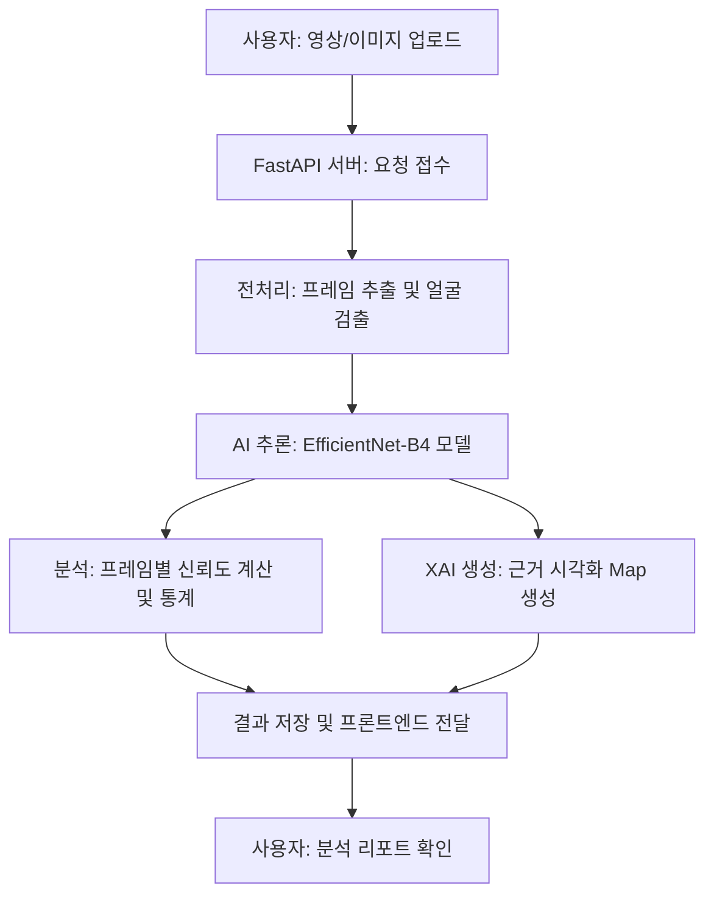

# Deepfake Detection Platform: 기술 가이드 및 워크플로우

이 문서는 Deepfake Detection Platform의 전체적인 동작 원리, 사용된 알고리즘, 그리고 시스템의 특징적인 요소들을 처음 접하는 개발자와 사용자들을 위해 설명합니다.

---

## 1. 전체 워크플로우 (Overall Workflow)

본 플랫폼은 사용자가 업로드한 영상이나 이미지에서 딥페이크 여부를 판별하고, 그 근거를 시각적으로 제시하는 End-to-End 시스템입니다.

1.  **입력 단계**: 사용자가 웹 인터페이스를 통해 분석할 파일(MP4, JPG 등)을 업로드합니다.
2.  **전처리 단계**: 
    - 영상의 경우 전체 프레임 중 고르게 샘플링하여 추출합니다.
    - **RetinaFace** 모델을 사용하여 각 프레임 내의 모든 얼굴을 검출하고 정렬(Crop)합니다.
3.  **AI 추론 단계**: 추출된 얼굴 이미지를 신경망 모델에 입력하여 'Real' 또는 'Fake' 점수를 산출합니다.
4.  **근거 생성(XAI) 단계**: 가장 의심되는 프레임을 선정하여 모델이 어디를 보고 판별했는지 시각화 자료를 만듭니다.
5.  **결과 출력 단계**: 전체 신뢰도, 조작 비율, 타임라인 정보 및 포렌식 증거(히트맵 등)를 포함한 리포트를 화면에 표시합니다.

---

## 2. 핵심 알고리즘 및 AI 기술

### 2.1 얼굴 검출 (Face Detection)
- **RetinaFace (ResNet50)**: 고성능 얼굴 검출 알고리즘을 사용하여 다양한 각도와 조명에서도 정확하게 얼굴 영역을 찾아냅니다. 
- 한 프레임에 여러 명이 있을 경우 모든 얼굴을 각각 분석하여 가장 높은 조작 가능성을 가진 데이터를 기준으로 결과에 반영합니다.

### 2.2 딥페이크 판별 모델 (Deepfake Detection)
- **Architecture**: **EfficientNet-B4**를 백본으로 사용합니다. 이는 연산 효율성과 높은 정확도를 동시에 보장하는 최첨단 합성곱 신경망입니다.
- **학습 기법**: **SBI (Self-Blended Images)** 로직이 적용된 가중치를 사용합니다. 이는 인위적인 합성 경계를 모델이 학습하도록 유도하여, 학습 데이터에 없던 새로운 방식의 딥페이크(Generalization)도 효과적으로 탐지할 수 있게 합니다.

### 2.3 설명 가능한 AI (Explainable AI, XAI)
단순히 "가짜입니다"라고 말하는 대신, 포렌식 관점의 세 가지 시각적 근거를 제공합니다.

1.  **LayerCAM (Attention Map)**:
    - 모델의 마지막 컨볼루션 계층에서 활성화된 영역을 시각화합니다.
    - 딥페이크의 경우 주로 눈, 입 주변 등 합성 흔적이 많이 남는 영역에 히트맵이 집중되는 경향이 있습니다.
2.  **Frequency Spectrum (FFT)**:
    - 이미지를 주파수 도메인으로 변환하여 분석합니다.
    - AI가 생성한 이미지는 일반 사진과 달리 고주파 영역에서 특정한 격자무늬나 이상 패턴이 나타나는데, 이를 통해 조작 여부를 입증합니다.
3.  **Texture Map (Laplacian)**:
    - 이미지의 질감 변화를 분석합니다. 
    - 합성된 경계면이나 부자연스러운 피부 질감 등 픽셀 단위의 미세한 불연속성을 강조하여 시각화합니다.

---

## 3. 특징적인 요소 (Key Features)

- **정밀한 타임라인 분석**: 영상 전체에 대한 단순 평균이 아니라, 프레임별 신뢰도 변화를 그래프로 제공하여 영상 내 특정 시점에만 포함된 딥페이크도 놓치지 않습니다.
- **다중 얼굴 대응**: 한 화면에 등장하는 모든 인물을 각각 추론하여 분석의 빈틈을 최소화합니다.
- **포렌식 리포트**: LayerCAM, 주파수 분석, 질감 분석 등 3종 포렌식 증거를 제공하여 전문가 수준의 분석 데이터를 제공합니다.
- **반응형 웹 UI**: 모바일 및 데스크톱 환경에서 모두 쾌적하게 분석 결과를 확인할 수 있도록 최적화되어 있습니다.

---

## 4. 기술 스택 (Tech Stack)

- **Frontend**: React, TypeScript, TailwindCSS, Lucide Icons, Chart.js
- **Backend**: FastAPI (Python), PyTorch, OpenCV, SQLite
- **AI/ML**: EfficientNet-B4, RetinaFace, FFT/Laplacian Analysis
